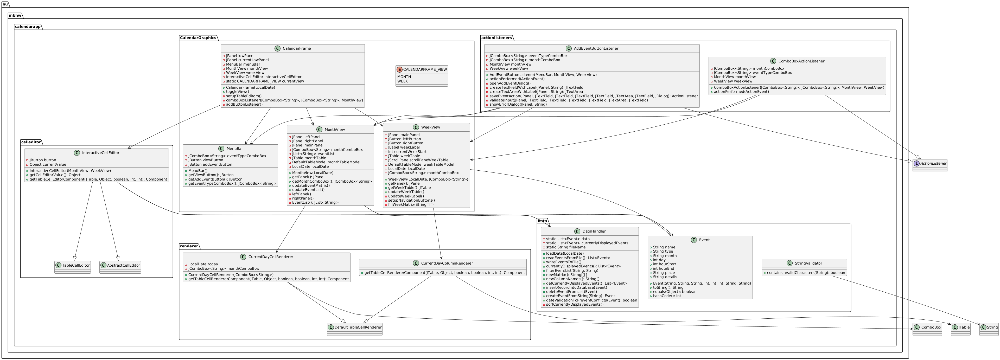

# Calendar App

A **Java-based calendar application** designed for managing events. This project provides a monthly and weekly view of events, allowing users to add, edit, and delete events. The app also features conflict validation to ensure no overlapping events are scheduled.

## Features

- **Month View**: Displays a grid-based calendar for the selected month.
- **Week View**: Displays a table-based representation of events for a specific week.
- **Event Management**: Add, edit, and delete events via intuitive dialogs.
- **Conflict Validation**: Prevents scheduling conflicts for events.
- **Customizable Views**: Switch between monthly and weekly calendar views.
- **Event Filtering**: Filter events based on the month and type (e.g., Home, Work, Other).

## Project Structure

```
src/
└── main/
    ├── java/
    │   └── hu.mbhw.calendarapp/
    │       ├── actionlisteners/   # Event listener classes
    │       ├── CalendarGraphics/  # UI components (MonthView, WeekView, etc.)
    │       ├── celleditor/        # Custom JTable cell editor
    │       ├── data/              # Data handling, event storage, and validation
    │       └── renderer/          # Custom renderers for table cells
    └── resources/
```

### Key Components
- **`CalendarGraphics`**: Contains UI elements like `MonthView`, `WeekView`, `MenuBar`, and `CalendarFrame`.
- **`actionlisteners`**: Event listeners such as `AddEventButtonListener` and `ComboBoxActionListener`.
- **`data`**: Handles data storage, retrieval, validation, and file I/O (`DataHandler`, `Event`, `StringValidator`).
- **`renderer`**: Custom renderers for highlighting the current day or week in the calendar view.

### Project UML Diagram



## Installation and Setup

1. **Clone the repository**:
   ```bash
   git clone https://github.com/martonbakk/calendar-app-hw.git
   cd calendar-app-hw
   ```

2. **Open the project**:
   Import the project into your favorite Java IDE (e.g., IntelliJ IDEA, Eclipse).

3. **Build the project**:
   Ensure you have MVN and JDK 11 or higher installed. Configure your IDE to use the correct JDK version.

4. **Run the application**:
   Run the `App` class located in `hu.mbhw.calendarapp.app`.

## Usage

- **Add an Event**:
  - Click the "Add Event" button in the top menu.
  - Fill out the event details (name, date, time, type, and description).
  - Save the event to display it in the calendar view.

- **Switch Views**:
  - Use the "Change View" button to toggle between the monthly and weekly calendar views.

- **Edit/Delete Events**:
  - Click on an event in the calendar to edit or delete it.

## Testing

This project includes basic test cases to verify key functionalities.

1. Run the tests using your IDE or:
   ```bash
   mvn verify
   ```
2. Build the project:
   ```bash
   mvn compile
   ```

## Technologies Used

- **Java**: Core programming language.
- **Swing**: For building the graphical user interface.
- **JUnit**: For unit testing.
- **Maven**: For building and veryfing tests.

## Contributing

1. Fork the repository.
2. Create your feature branch:
   ```bash
   git checkout -b feature-name
   ```
3. Commit your changes:
   ```bash
   git commit -m "Add new feature"
   ```
4. Push to the branch:
   ```bash
   git push origin feature-name
   ```
5. Open a pull request.

## Contact

For any questions or suggestions, feel free to reach out via [GitHub Issues](https://github.com/martonbakk/calendar-app-hw/issues).
